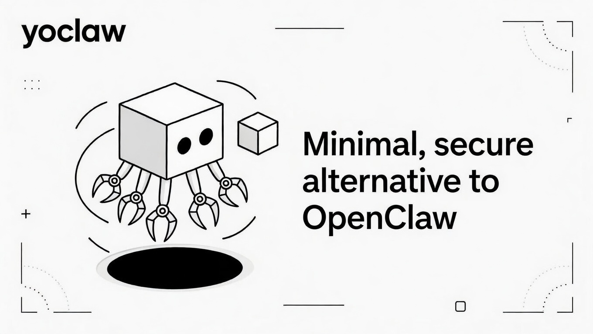

<p align="center">
  
</p>

<p align="center">
  <a href="https://crates.io/crates/yoclaw">crates.io</a> ·
  <a href="https://docs.rs/yoclaw">Docs</a> ·
  <a href="https://github.com/yologdev/yoclaw">GitHub</a> ·
  <a href="https://deepwiki.com/yologdev/yoclaw">DeepWiki</a> ·
  <a href="https://github.com/yologdev/yoclaw/issues">Issues</a> ·
  <a href="https://github.com/yologdev/yoclaw/releases">Releases</a>
</p>

<p align="center">
  <a href="https://crates.io/crates/yoclaw"></a>
  <a href="https://github.com/yologdev/yoclaw/actions"></a>
  <a href="LICENSE"></a>
  <a href="https://docs.rs/yoclaw"></a>
  <a href="https://github.com/yologdev/yoclaw/commits/master"></a>
</p>

---

# yoclaw: Single-Binary AI Agent

**yoclaw** is a minimal, secure alternative to [OpenClaw](https://github.com/anthropics/openclaw) — a single Rust binary that turns any LLM into a persistent, tool-using agent on messaging platforms. Built on [yoagent](https://github.com/yologdev/yoagent).

No Docker. No Redis. No infrastructure. One binary, one config file.

## Core Capabilities

- **Pluggable channels** — Telegram today, Discord/Slack next. Add new platforms by implementing one trait.
- **SQLite persistence** — Conversations, message queue, long-term memory (FTS5), and audit logs in a single file.
- **Crash recovery** — Messages are queued before processing. Kill -9, restart, nothing lost.
- **Security policies** — Tool permissions, shell deny patterns, path/host allowlists, per-tool enable/disable.
- **Budget tracking** — Token and turn limits per day/session with automatic enforcement.
- **Skills system** — Drop markdown files into `~/.yoclaw/skills/` to teach your agent new capabilities.
- **Worker delegation** — Configure named sub-agents with different models for specialized tasks.
- **Long-term memory** — Full-text search over stored facts, preferences, and context.

## Quick Start

```bash
# Build
cargo build --release

# Initialize config directory
./yoclaw init

# Edit config with your keys
vim ~/.yoclaw/config.toml

# Run
ANTHROPIC_API_KEY=sk-ant-... TELEGRAM_BOT_TOKEN=123:ABC... ./yoclaw
```

## Configuration

```toml
[agent]
provider = "anthropic"
model = "claude-opus-4-6"
api_key = "${ANTHROPIC_API_KEY}"

[agent.budget]
max_tokens_per_day = 1_000_000
max_turns_per_session = 50

[agent.workers.research]
model = "claude-sonnet-4-20250514"
system_prompt = "You are a research assistant."
max_turns = 15

[channels.telegram]
bot_token = "${TELEGRAM_BOT_TOKEN}"
allowed_senders = [123456789]
debounce_ms = 2000

[security]
shell_deny_patterns = ["rm -rf", "sudo", "chmod 777"]
```

Customize the persona in `~/.yoclaw/persona.md`.

## Adding Skills

```bash
mkdir -p ~/.yoclaw/skills/my-skill
cat > ~/.yoclaw/skills/my-skill/SKILL.md << 'EOF'
---
name: my-skill
description: What this skill does
tools: [http]
---

Instructions for the agent when this skill is relevant.
EOF
```

Skills requiring disabled tools are automatically excluded.

## Inspect

```bash
yoclaw inspect                    # Queue, sessions, budget, audit
yoclaw inspect --skills           # Loaded skills and their tool requirements
yoclaw inspect --workers          # Configured worker sub-agents
yoclaw inspect --session tg-123   # Filter audit by session
```

## Architecture

```
Telegram → Coalescer → Queue (SQLite) → Conductor → Agent (yoagent) → Response → Telegram
                                            ↓
                                     Security Policy
                                     Budget Tracker
                                     Memory (FTS5)
                                     Worker Delegation
```

The Conductor owns a single yoagent `Agent` and switches between sessions by saving/loading conversation state. All tool calls pass through `SecureToolWrapper` for policy enforcement and audit logging.

## Project Structure

```
src/
├── main.rs              CLI + event loop
├── config.rs            TOML config with env var expansion
├── conductor/           Agent orchestration + workers
├── channels/            Messaging platform adapters
├── db/                  SQLite: tape, queue, memory, audit
├── security/            Policy enforcement + budget tracking
└── skills/              Skill loading with capability filtering
```

## Requirements

- Rust 1.75+
- [yoagent](https://crates.io/crates/yoagent) v0.5.1+

## License

[MIT](LICENSE)
